<a href="https://www.nabilamelsyana.com/"><picture><source media="(max-width: 767px)" srcset="assets/hero-m.svg"></picture></a>

I’m **Nabila Melsyana**, a full-stack developer in Jakarta, Indonesia, working at **MAXY Academy**. I start with the problem a product is there to solve, then take it from first requirements to release: interface, server, database, testing, launch. Mostly **Laravel** and **React / Next.js** with TypeScript, on MySQL or PostgreSQL. Information Systems graduate of Telkom University and a BNSP-certified System Analyst.

**[Portfolio](https://www.nabilamelsyana.com/)** &nbsp;·&nbsp; **[LinkedIn](https://www.linkedin.com/in/nabilamelsyana)** &nbsp;·&nbsp; **[CV (PDF)](https://www.nabilamelsyana.com/cv.pdf)** &nbsp;·&nbsp; **[nabilamelsyana5@gmail.com](mailto:nabilamelsyana5@gmail.com)**

<picture><source media="(max-width: 767px) and (prefers-color-scheme: dark)" srcset="assets/strip-m-dark.svg"><source media="(max-width: 767px)" srcset="assets/strip-m-light.svg"><source media="(prefers-color-scheme: dark)" srcset="assets/strip-dark.svg">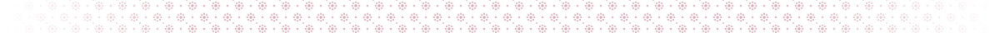</picture>

<picture><source media="(max-width: 767px) and (prefers-color-scheme: dark)" srcset="assets/h-work-m-dark.svg"><source media="(max-width: 767px)" srcset="assets/h-work-m-light.svg"><source media="(prefers-color-scheme: dark)" srcset="assets/h-work-dark.svg"></picture>

<a href="https://nova.maxy.academy/"><picture><source media="(max-width: 767px)" srcset="assets/work-nova-m.svg">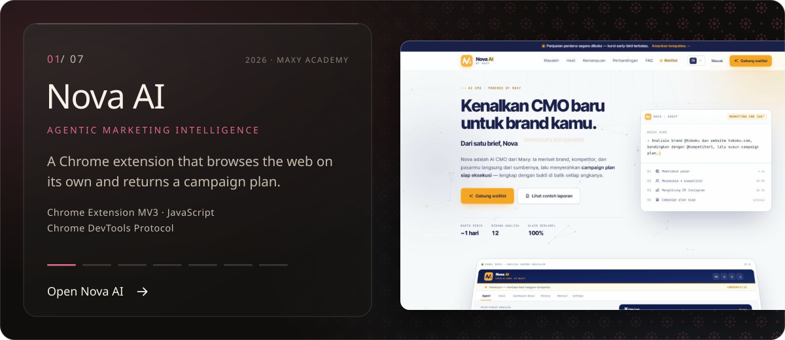</picture></a>

<a href="https://flowbuddy.maxy.academy/"><picture><source media="(max-width: 767px)" srcset="assets/work-flowbuddy-m.svg">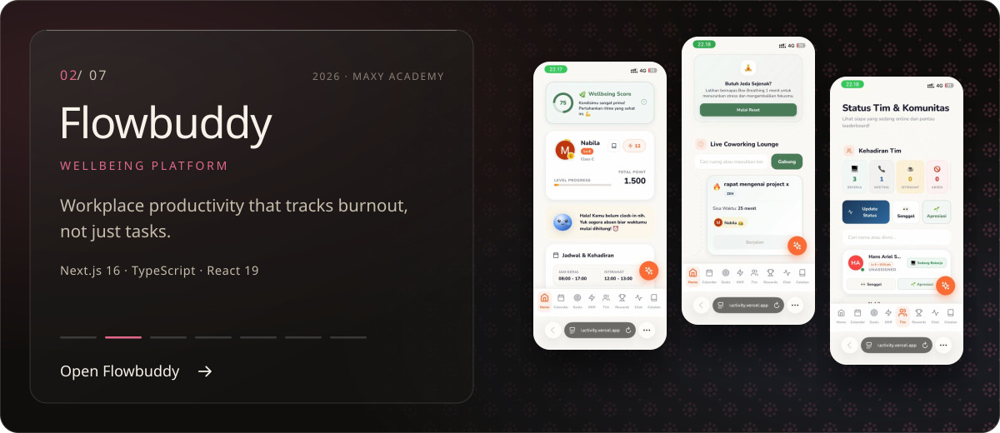</picture></a>

<a href="https://vero.maxy.academy/"><picture><source media="(max-width: 767px)" srcset="assets/work-vero-m.svg">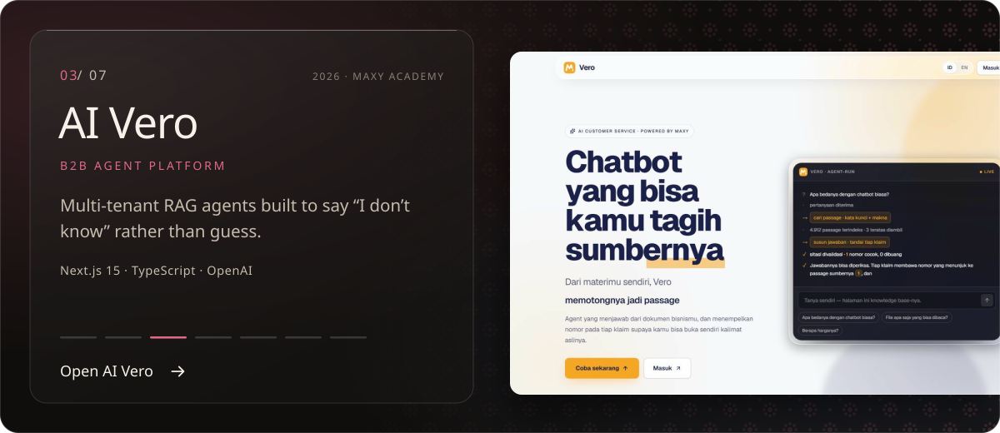</picture></a>

<a href="https://lms-nabila-project.vercel.app/"><picture><source media="(max-width: 767px)" srcset="assets/work-lms-m.svg">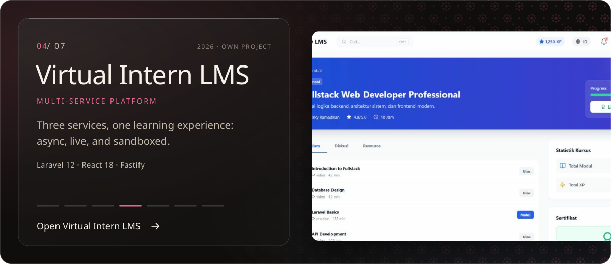</picture></a>

<a href="https://dashboard-quiz-project.vercel.app/"><picture><source media="(max-width: 767px)" srcset="assets/work-maxy-m.svg">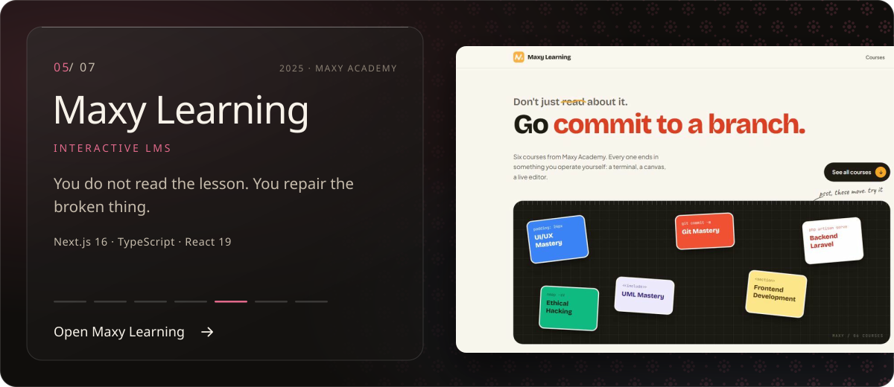</picture></a>

<a href="https://pos-car-wash.vercel.app/"><picture><source media="(max-width: 767px)" srcset="assets/work-otopia-m.svg">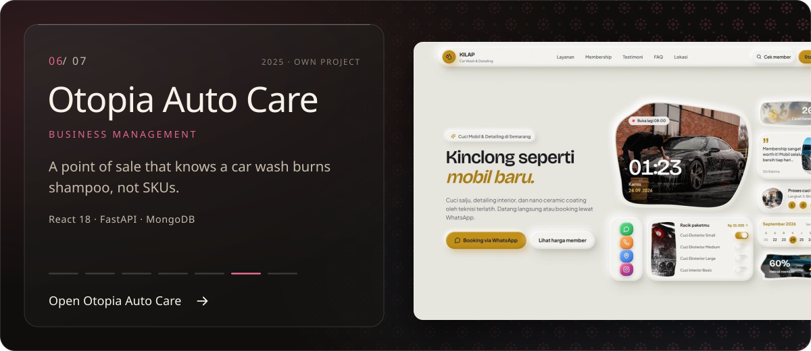</picture></a>

<a href="https://weborder-project.vercel.app/"><picture><source media="(max-width: 767px)" srcset="assets/work-weborder-m.svg">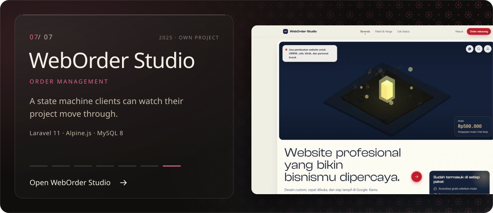</picture></a>

Live: [Nova AI](https://nova.maxy.academy/) &nbsp;·&nbsp; [Flowbuddy](https://flowbuddy.maxy.academy/) &nbsp;·&nbsp; [AI Vero](https://vero.maxy.academy/) &nbsp;·&nbsp; [Virtual Intern LMS](https://lms-nabila-project.vercel.app/) &nbsp;·&nbsp; [Maxy Learning](https://dashboard-quiz-project.vercel.app/) &nbsp;·&nbsp; [Otopia Auto Care](https://pos-car-wash.vercel.app/) &nbsp;·&nbsp; [WebOrder Studio](https://weborder-project.vercel.app/)

<picture><source media="(max-width: 767px) and (prefers-color-scheme: dark)" srcset="assets/strip-m-dark.svg"><source media="(max-width: 767px)" srcset="assets/strip-m-light.svg"><source media="(prefers-color-scheme: dark)" srcset="assets/strip-dark.svg"></picture>

<picture><source media="(max-width: 767px) and (prefers-color-scheme: dark)" srcset="assets/h-skills-m-dark.svg"><source media="(max-width: 767px)" srcset="assets/h-skills-m-light.svg"><source media="(prefers-color-scheme: dark)" srcset="assets/h-skills-dark.svg">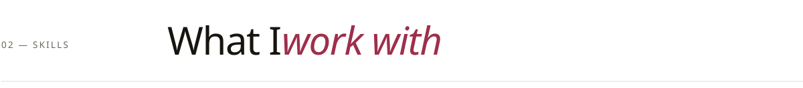</picture>

<picture><source media="(max-width: 767px)" srcset="assets/skills-m.svg">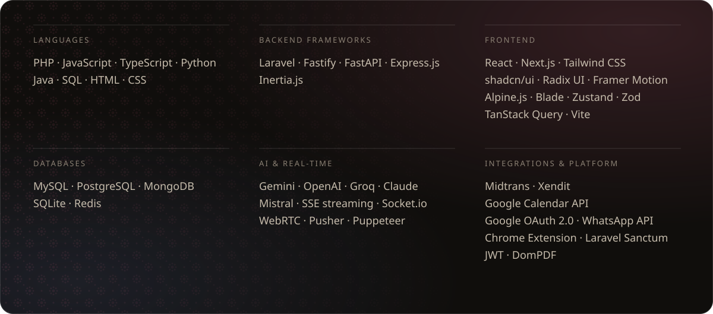</picture>

<picture><source media="(max-width: 767px) and (prefers-color-scheme: dark)" srcset="assets/strip-m-dark.svg"><source media="(max-width: 767px)" srcset="assets/strip-m-light.svg"><source media="(prefers-color-scheme: dark)" srcset="assets/strip-dark.svg"></picture>

<picture><source media="(max-width: 767px) and (prefers-color-scheme: dark)" srcset="assets/h-experience-m-dark.svg"><source media="(max-width: 767px)" srcset="assets/h-experience-m-light.svg"><source media="(prefers-color-scheme: dark)" srcset="assets/h-experience-dark.svg">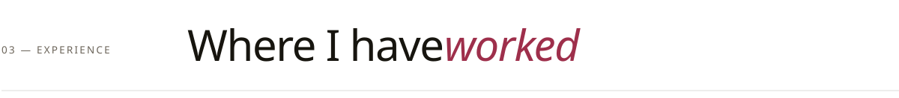</picture>

<picture><source media="(max-width: 767px)" srcset="assets/experience-m.svg">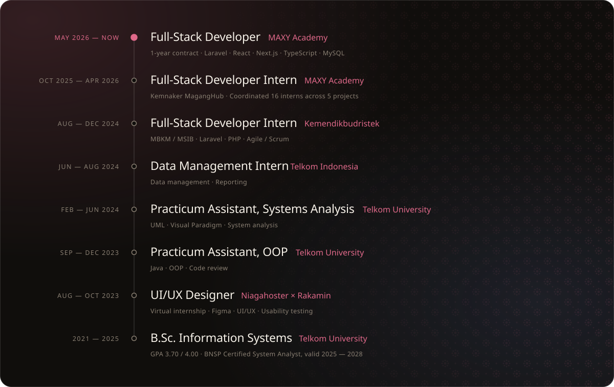</picture>

<picture><source media="(max-width: 767px) and (prefers-color-scheme: dark)" srcset="assets/strip-m-dark.svg"><source media="(max-width: 767px)" srcset="assets/strip-m-light.svg"><source media="(prefers-color-scheme: dark)" srcset="assets/strip-dark.svg"></picture>

<picture><source media="(max-width: 767px) and (prefers-color-scheme: dark)" srcset="assets/h-contact-m-dark.svg"><source media="(max-width: 767px)" srcset="assets/h-contact-m-light.svg"><source media="(prefers-color-scheme: dark)" srcset="assets/h-contact-dark.svg"></picture>

<picture><source media="(max-width: 767px)" srcset="assets/contact-m.svg">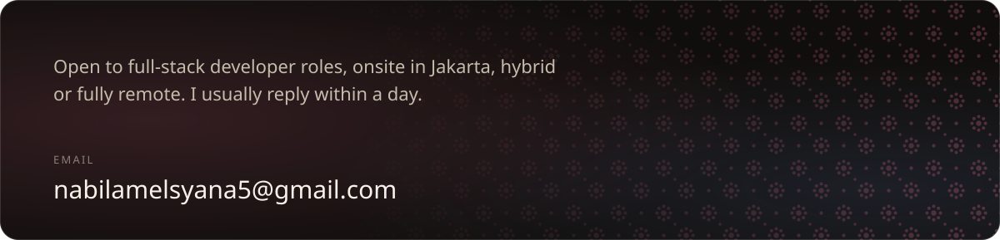</picture>

<a href="mailto:nabilamelsyana5@gmail.com"><picture><source media="(max-width: 767px)" srcset="assets/btn-email-m.svg"></picture></a>
<a href="https://www.nabilamelsyana.com/"><picture><source media="(max-width: 767px)" srcset="assets/btn-portfolio-m.svg"></picture></a>
<a href="https://www.linkedin.com/in/nabilamelsyana"><picture><source media="(max-width: 767px)" srcset="assets/btn-linkedin-m.svg"></picture></a>
<a href="https://www.nabilamelsyana.com/cv.pdf"><picture><source media="(max-width: 767px)" srcset="assets/btn-cv-m.svg"></picture></a>

