<a href="https://www.nabilamelsyana.com/"><picture><source media="(max-width: 767px) and (prefers-color-scheme: dark)" srcset="assets/hero-m-dark.svg"><source media="(max-width: 767px)" srcset="assets/hero-m-light.svg"><source media="(prefers-color-scheme: dark)" srcset="assets/hero-dark.svg"></picture></a>

Hi, I’m **Nabila Melsyana**, a full-stack developer in Jakarta, Indonesia. I work out the problem first, then build the whole product around it: the database, the API, the interface and the release. Mostly **Laravel** and **React / Next.js** with TypeScript, on MySQL or PostgreSQL, with AI where it does real work. I’m a Full-Stack Developer at MAXY Academy, an Information Systems graduate of Telkom University, and a BNSP-certified System Analyst.

**[Portfolio](https://www.nabilamelsyana.com/)** &nbsp;·&nbsp; **[LinkedIn](https://www.linkedin.com/in/nabilamelsyana)** &nbsp;·&nbsp; **[CV (PDF)](https://www.nabilamelsyana.com/cv.pdf)** &nbsp;·&nbsp; **[nabilamelsyana5@gmail.com](mailto:nabilamelsyana5@gmail.com)**

 

<picture><source media="(max-width: 767px) and (prefers-color-scheme: dark)" srcset="assets/title-work-m-dark.svg"><source media="(max-width: 767px)" srcset="assets/title-work-m-light.svg"><source media="(prefers-color-scheme: dark)" srcset="assets/title-work-dark.svg"></picture>

These are the projects I’m free to show. Each one has a full case study on [nabilamelsyana.com](https://www.nabilamelsyana.com/#work).

<a href="https://nova.maxy.academy/"><picture><source media="(prefers-color-scheme: dark)" srcset="assets/cover-nova-dark.svg"></picture></a>

### [Nova AI](https://nova.maxy.academy/)

AGENTIC MARKETING RESEARCH · 2026 · MAXY ACADEMY · SOLO

Marketing teams lose days to competitor research before a campaign brief can even be written, and the research goes stale almost at once. Nova is a Chrome extension that takes one brief, researches the brand and its competitors on the live web by itself, and hands back a written market report and a ready-to-use Excel campaign plan. Seven AI providers sit behind one interface, with failover when a key hits its limit.

`Chrome Extension MV3` `JavaScript` `Chrome DevTools Protocol` `Gemini` `Groq` `OpenAI` `Claude` &nbsp;·&nbsp; **[Open Nova AI ↗](https://nova.maxy.academy/)**

 

<a href="https://flowbuddy.maxy.academy/"><picture><source media="(prefers-color-scheme: dark)" srcset="assets/cover-flowbuddy-dark.svg"></picture></a>

### [Flowbuddy](https://flowbuddy.maxy.academy/)

EMPLOYEE PRODUCTIVITY AND WELLBEING · 2026 · MAXY ACADEMY · TEAM OF TWO

Productivity tools measure output and ignore the person producing it, so burnout only shows once someone has already stopped. Flowbuddy keeps tasks, attendance and daily mood check-ins in one place, and warns a manager when the trend turns. Built by two people; I worked across both the frontend and the backend.

`Next.js 16` `React 19` `TypeScript` `MySQL` `Gemini AI` `Pusher` `PWA` &nbsp;·&nbsp; **[Open Flowbuddy ↗](https://flowbuddy.maxy.academy/)**

 

<a href="https://vero.maxy.academy/"><picture><source media="(prefers-color-scheme: dark)" srcset="assets/cover-vero-dark.svg"></picture></a>

### [AI Vero](https://vero.maxy.academy/)

MULTI-TENANT AI SUPPORT AGENTS · 2026 · MAXY ACADEMY · SOLO

A support bot that makes up an answer is worse than no bot at all. AI Vero lets a company upload its own documents and web pages and get a customer-service agent that answers only from that material and says “I don’t know” otherwise, with billing, analytics and handover to a human agent built in.

`Next.js 15` `TypeScript` `OpenAI` `RAG` `SQLite` `SSE streaming` `Tailwind CSS` &nbsp;·&nbsp; **[Open AI Vero ↗](https://vero.maxy.academy/)**

 

<a href="https://lms-nabila-project.vercel.app/"><picture><source media="(prefers-color-scheme: dark)" srcset="assets/cover-lms-dark.svg"></picture></a>

### [Virtual Intern LMS](https://lms-nabila-project.vercel.app/)

LEARNING PLATFORM IN THREE SERVICES · 2026 · PERSONAL PROJECT · SOLO

Running a paid online internship means teaching, meeting, assessing and invoicing, and no single service does all four well. This one does it behind one interface: courses and quizzes, live classes that record themselves, graded coding assignments, payment and certificates, split across three services.

`Laravel 12` `React 18` `Fastify` `PostgreSQL` `WebRTC` `Socket.io` `Xendit` &nbsp;·&nbsp; **[Open Virtual Intern LMS ↗](https://lms-nabila-project.vercel.app/)**

 

<a href="https://dashboard-quiz-project.vercel.app/"><picture><source media="(prefers-color-scheme: dark)" srcset="assets/cover-maxy-dark.svg"></picture></a>

### [Maxy Learning](https://dashboard-quiz-project.vercel.app/)

HANDS-ON LEARNING PLATFORM · 2025 · MAXY ACADEMY · SOLO

A multiple-choice quiz tests whether someone remembers the chapter, not whether they can do the work. Every lesson here is an exercise the system grades: repair a broken interface, assemble a UML diagram on a canvas, run real Git commands and watch the branch tree redraw.

`Next.js 16` `React 19` `TypeScript` `Tailwind CSS` `Framer Motion` &nbsp;·&nbsp; **[Open Maxy Learning ↗](https://dashboard-quiz-project.vercel.app/)**

 

<a href="https://pos-car-wash.vercel.app/"><picture><source media="(prefers-color-scheme: dark)" srcset="assets/cover-otopia-dark.svg"></picture></a>

### [Otopia Auto Care](https://pos-car-wash.vercel.app/)

CAR WASH POINT OF SALE · 2025 · PERSONAL PROJECT · SOLO

A car wash sells services that quietly use up shampoo, wax and cloth, so ordinary POS stock never matches what is on the shelf. Otopia defines each service by the materials it consumes, so ringing up a wash draws them down. Cash is reconciled per shift, and staff commission comes from the same sales records as the daily report.

`React 18` `FastAPI` `Python` `MongoDB` `shadcn/ui` `Recharts` `WhatsApp API` &nbsp;·&nbsp; **[Open Otopia Auto Care ↗](https://pos-car-wash.vercel.app/)**

 

<a href="https://weborder-project.vercel.app/"><picture><source media="(prefers-color-scheme: dark)" srcset="assets/cover-weborder-dark.svg"></picture></a>

### [WebOrder Studio](https://weborder-project.vercel.app/)

AGENCY ORDERS AND STAGED PAYMENTS · 2025 · PERSONAL PROJECT · SOLO

An agency website runs for weeks, gets revised and is paid in stages, which is exactly what spreadsheets and status emails handle worst. WebOrder models the order, the payment and the project as state machines, so a client watches the job move from order to handover instead of asking where it stands. One confirmed payment produces the invoice, the project record and a WhatsApp notice.

`Laravel 11` `PHP 8.2` `MySQL 8` `Alpine.js` `Midtrans` `Google Calendar API` `DomPDF` &nbsp;·&nbsp; **[Open WebOrder Studio ↗](https://weborder-project.vercel.app/)**

 

<picture><source media="(max-width: 767px) and (prefers-color-scheme: dark)" srcset="assets/title-stack-m-dark.svg"><source media="(max-width: 767px)" srcset="assets/title-stack-m-light.svg"><source media="(prefers-color-scheme: dark)" srcset="assets/title-stack-dark.svg"></picture>

| Backend | Frontend | Data | AI and integrations |
| :-- | :-- | :-- | :-- |
| Laravel, PHP 8 | React, Next.js | MySQL | Gemini, OpenAI, Claude |
| FastAPI, Python | TypeScript | PostgreSQL | RAG retrieval, SSE |
| Fastify, Express | Tailwind CSS | MongoDB | Midtrans, Xendit |
| REST API design | shadcn/ui, Radix UI | SQLite, Redis | WhatsApp API |
| Sanctum, JWT, RBAC | Framer Motion | Socket.io, WebRTC | Chrome Extension MV3 |

 

<picture><source media="(max-width: 767px) and (prefers-color-scheme: dark)" srcset="assets/title-path-m-dark.svg"><source media="(max-width: 767px)" srcset="assets/title-path-m-light.svg"><source media="(prefers-color-scheme: dark)" srcset="assets/title-path-dark.svg"></picture>

| Role | Where | When |
| :-- | :-- | :-- |
| **Full-Stack Developer** | MAXY Academy | Oct 2025 to now |
| Full-Stack Developer | Ministry of Education, MSIB | Aug to Dec 2024 |
| Data Management | Telkom Indonesia | Jun to Aug 2024 |
| Practicum Assistant, ADSI | Telkom University | Feb to Jun 2024 |
| Practicum Assistant, OOP | Telkom University | Sep to Dec 2023 |
| UI/UX Designer | Niagahoster x Rakamin | Aug to Oct 2023 |

**B.Sc. Information Systems**, Telkom University, 2021 to 2025, GPA 3.70 / 4.00 
**BNSP Certified System Analyst**, valid 2025 to 2028

 

<picture><source media="(max-width: 767px) and (prefers-color-scheme: dark)" srcset="assets/closing-m-dark.svg"><source media="(max-width: 767px)" srcset="assets/closing-m-light.svg"><source media="(prefers-color-scheme: dark)" srcset="assets/closing-dark.svg"></picture>

<a href="mailto:nabilamelsyana5@gmail.com"><picture><source media="(max-width: 767px) and (prefers-color-scheme: dark)" srcset="assets/btn-email-m-dark.svg"><source media="(max-width: 767px)" srcset="assets/btn-email-m-light.svg"><source media="(prefers-color-scheme: dark)" srcset="assets/btn-email-dark.svg"></picture></a>
<a href="https://www.nabilamelsyana.com/"><picture><source media="(max-width: 767px) and (prefers-color-scheme: dark)" srcset="assets/btn-portfolio-m-dark.svg"><source media="(max-width: 767px)" srcset="assets/btn-portfolio-m-light.svg"><source media="(prefers-color-scheme: dark)" srcset="assets/btn-portfolio-dark.svg"></picture></a>
<a href="https://www.linkedin.com/in/nabilamelsyana"><picture><source media="(max-width: 767px) and (prefers-color-scheme: dark)" srcset="assets/btn-linkedin-m-dark.svg"><source media="(max-width: 767px)" srcset="assets/btn-linkedin-m-light.svg"><source media="(prefers-color-scheme: dark)" srcset="assets/btn-linkedin-dark.svg"></picture></a>
<a href="https://www.nabilamelsyana.com/cv.pdf"><picture><source media="(max-width: 767px) and (prefers-color-scheme: dark)" srcset="assets/btn-cv-m-dark.svg"><source media="(max-width: 767px)" srcset="assets/btn-cv-m-light.svg"><source media="(prefers-color-scheme: dark)" srcset="assets/btn-cv-dark.svg"></picture></a>

