<a href="https://www.nabilamelsyana.com/"><picture><source media="(prefers-color-scheme: dark)" srcset="assets/hero-dark.svg"></picture></a>

 

<picture><source media="(prefers-color-scheme: dark)" srcset="assets/title-work-dark.svg"></picture>

<a href="https://nova.maxy.academy/"><picture><source media="(prefers-color-scheme: dark)" srcset="assets/work-nova-dark.svg"></picture></a>

<a href="https://vero-agent.vercel.app/login"><picture><source media="(prefers-color-scheme: dark)" srcset="assets/work-vero-dark.svg"></picture></a>
<a href="https://flowbuddy-productivity.vercel.app/"><picture><source media="(prefers-color-scheme: dark)" srcset="assets/work-flowbuddy-dark.svg"></picture></a>

<a href="https://lms-nabila-project.vercel.app/login"><picture><source media="(prefers-color-scheme: dark)" srcset="assets/work-lms-dark.svg"></picture></a>
<a href="https://pos-car-wash.vercel.app/"><picture><source media="(prefers-color-scheme: dark)" srcset="assets/work-otopia-dark.svg"></picture></a>

<a href="https://www.nabilamelsyana.com/#work"><picture><source media="(prefers-color-scheme: dark)" srcset="assets/work-weborder-dark.svg"></picture></a>

 

<picture><source media="(prefers-color-scheme: dark)" srcset="assets/title-stack-dark.svg"></picture>

<picture><source media="(prefers-color-scheme: dark)" srcset="assets/stack-dark.svg"></picture>

 

<picture><source media="(prefers-color-scheme: dark)" srcset="assets/title-path-dark.svg"></picture>

<picture><source media="(prefers-color-scheme: dark)" srcset="assets/trajectory-dark.svg"></picture>

 

<picture><source media="(prefers-color-scheme: dark)" srcset="assets/closing-dark.svg"></picture>

<a href="mailto:nabilamelsyana5@gmail.com"><picture><source media="(prefers-color-scheme: dark)" srcset="assets/btn-email-dark.svg"></picture></a>
<a href="https://www.nabilamelsyana.com/"><picture><source media="(prefers-color-scheme: dark)" srcset="assets/btn-portfolio-dark.svg"></picture></a>
<a href="https://www.linkedin.com/in/nabilamelsyana"><picture><source media="(prefers-color-scheme: dark)" srcset="assets/btn-linkedin-dark.svg"></picture></a>
<a href="https://www.nabilamelsyana.com/cv.pdf"><picture><source media="(prefers-color-scheme: dark)" srcset="assets/btn-cv-dark.svg"></picture></a>

